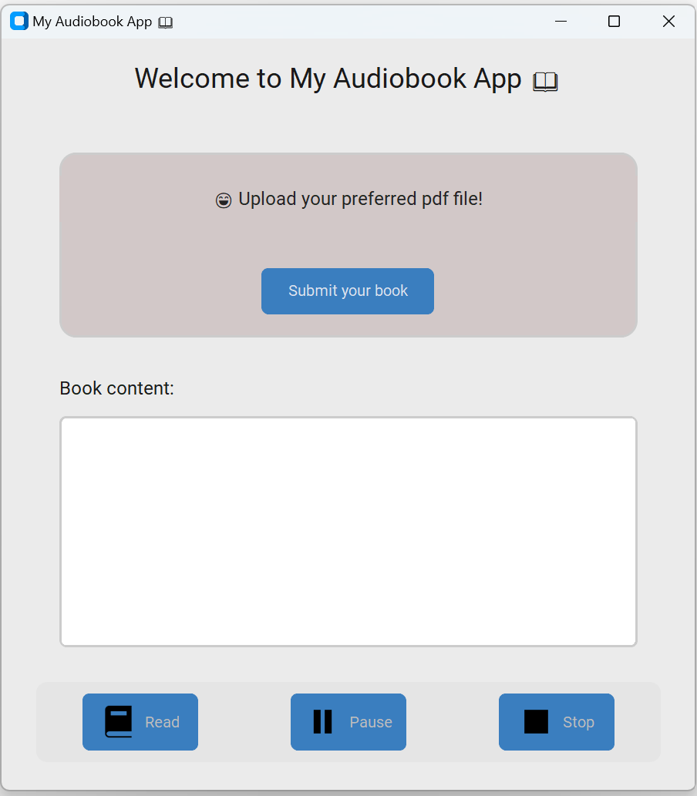

# How to build a Simple Audiobook Player with CustomTkinter and gTTS

In this tutorial, we will build a simple audiobook player using Python and CustomTkinter.
You will learn how to convert text into speech using gTTS and play it with PyGame.
We will also implement play, pause, and stop controls, like those in a real audio player.
By the end, you will have a clean and functional desktop audiobook app.

📌 Full tutorial: https://python-post.blogspot.com/2026/02/how-to-build-simple-audiobook-player.html

